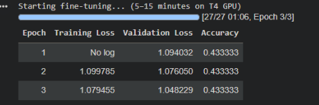
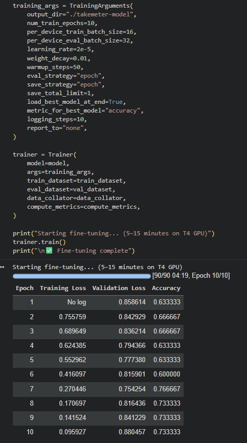

# TakeMeter — r/leagueoflegends Post Classifier

Fine-tuned DistilBERT vs. zero-shot LLaMA 3.3 70B on r/leagueoflegends posts.

---

## Why I Chose to Investigate r/leagueoflegends

I chose r/leagueoflegends because I play the game regularly and sometimes check this thread. This thread is a good fit for a classification task because posts can vary from highlights, discussion, and general advice. The community can be very polarizing because people in this thread come from varying levels of skill, which offers a diverse set of opinions. It's always fun to see other people's perspective on things because something I understand could be very new in the eyes of someone else and vice versa. My goal is to classify Reddit posts from r/leagueoflegends into labels that segment the post into 3 distinct categories.

---

## Label Definitions

| Label | Description |
|---|---|
| **Substantive Discussion** | A post that makes a specific claim, argument, or analysis about the game, meta, esports, or community with enough reasoning to promote debate. |
| **Question or Help Request** | A post that asks the community for advice, explanations, or opinions with enough context to receive a useful answer. |
| **Community or Entertainment Content** | A post that shares news, esports updates, patch previews, art, humor, nostalgia, or gameplay highlights — adds social/entertainment value but does not make an analytical argument or ask a specific gameplay question. |

---

## Dataset

- **Source:** r/leagueoflegends (collected via Reddit API)
- **Total examples:** 200
- **Split:** 70% train (140) / 15% validation (30) / 15% test (30)

| Label | Count |
|---|---|
| Substantive Discussion | 90 |
| Community or Entertainment Content | 62 |
| Question or Help Request | 48 |

### My Labeling approach

I used Claude to give baseline labels right off the bat based on my label definitions. Then I combed through each post and updated as I see fit. Overall I made 76 label changes that Claude mistakenly misclassified.

Here are 3 examples I changed (I did a lot more)

| Row | Change |
|---|---|
| 8 | question to substantive | 
| 14 | substantive to question |
| 15 | community to question |

### Some Difficult Examples to Label

- 16 difficult both a discussion and community

- 17 difficult not enough context looks like a continuation of another post

- 41 difficult Spanish post, used translate and deemed it a question

---

## Fine-Tuned-Model Parameters

The fine-tuned model uses DistilBERT with the default settings: num_train_epochs=10,per_device_train_batch_size=16, per_device_eval_batch_size=32, learning_rate=2e-5. The model did not learn the weights very well on the first pass. The accuracy was stuck at .4333.



After messing around with some parameters like learning rate 2e-5 to 1e-5 so that it converges more consistenly, and decreasing the batch size to have more gradient udpates, I found this didn't change the outcome. So eventually I moved back to the default settings and instead just increased the number of epochs which worked out. I do realize that increasing the number of epochs can result in overfitting but 10 epochs isn't that excessive. Here is my model after running the final spec.



I do see that my validation loss oscillated while the training loss continued its downward trend but the increased number of epochs improved the accuracy. Since the model with the best accuracy was saved (epoch 7) I kind of just went with it.

---

## Baseline Model

The Baseline Model uses LLaMA 3.3 70B and I used this prompt to classify my dataset:

```
You are classifying posts from r/leagueoflegends.
Assign each post to exactly one of the following categories.

Substantive Discussion: A post that makes a specific claim, argument, or analysis about the game, meta, esports, or community with enough reasoning promote debate.
Example: "Aegis is too unbalanced in favour of non-priority roles the most popular roles get autofilled the most and therefore receive guaranteed Aegis more often, making the ladder unfair."

Question or Help Request: A post that asks the community for advice, explanations, or opinions with enough context to receive a useful answer.
Example: "Can any champion essentially become a tank if they build all tank items, or does base kit matter too much? Asking because I want to know if it works for my main."

Community or Entertainment Content: A post that shares news, esports updates, patches previews, art, humor, nostalgia, or gameplay highlights. This type of post adds social or entertainment value but does not make an analytical argument or ask a specific gameplay question.
Example: "Phantasm becomes the first ever player to hit 4000 LP" or "I miss Twisted Treeline — it was removed in 2019 and it was my favorite mode."

Respond with ONLY the label name, exactly as written below.
Do not explain your reasoning.

Valid labels:
Substantive Discussion
Question or Help Request
Community or Entertainment Content
```

The model does not see any examples of my dataset. It only sees the label definitions in the prompt. Each of the test posts were sent individually as a user message and the model responded with only the label name.

## Evaluation Report

### Results Summary

| Model | Accuracy |
|---|---|
| Zero-shot baseline (Groq / LLaMA 3.3 70B) | **0.833** |
| Fine-tuned DistilBERT | **0.633** |

The baseline outperformed the fine-tuned model by approximately 20 percent. This might be due to the small training set size (200 examples). Also worthy to note that there is an imbalance in the labels where substantive discussion takes the majority (90) followed by community entertainment (62) then question (48). This doesn't provide enough context to generalize for the DistilBERT model. LLaMA was better at generalizing here because it uses broad pretraining knowledge making it a better fit for this training set.

---

### Per-Class Metrics

### Baseline (Zero-shot LLaMA 3.3 70B)

| Class | Precision | Recall | F1 | Support |
|---|---|---|---|---|
| Substantive Discussion | 0.86 | 0.86 | 0.86 | 14 |
| Question or Help Request | 0.75 | 0.86 | 0.80 | 7 |
| Community or Entertainment Content | 0.88 | 0.78 | 0.82 | 9 |
| **Macro avg** | **0.83** | **0.83** | **0.83** | 30 |

### Fine-Tuned DistilBERT

| Class | Precision | Recall | F1 | Support |
|---|---|---|---|---|
| Substantive Discussion | 0.61 | 0.79 | 0.69 | 14 |
| Question or Help Request | 0.50 | 0.29 | 0.36 | 7 |
| Community or Entertainment Content | 0.75 | 0.67 | 0.71 | 9 |
| **Macro avg** | **0.62** | **0.58** | **0.59** | 30 |

---

### Confusion Matrix (Fine-Tuned Model)

Rows = true label, columns = predicted label.

| | Pred: Substantive Discussion | Pred: Question or Help Request | Pred: Community or Entertainment Content |
|---|---|---|---|
| **True: Substantive Discussion** | 11 | 2 | 1 |
| **True: Question or Help Request** | 4 | 2 | 1 |
| **True: Community or Entertainment Content** | 3 | 0 | 6 |

---

## Error Analysis

### Most Confused Pair

The most frequent error was classifying **Question or Help Request and Community or Entertainment Content both being predicted as Substantive Discussion**. Of the 7 Question or Help Request examples in the test set, 4 (57%) were misclassified as Substantive Discussion. Of the 9 Community or Entertainment Content examples, 3 (33%) were misclassified as Substantive Discussion. The model treats Substantive Discussion as the default prediction when it is uncertain.

### Why This Boundary Is Hard

All three categories frequently involve game-specific language (champion names, mechanics, meta terms). The model learned to associate that vocabulary with Substantive Discussion because it was the largest class at 45% of training data which makes it hard to learning the distinguished intent. A question about Honor restrictions and a discussion post about Honor restrictions look pretty similar becasuse both can be framed as a question. What separates them is the rhetorical structure (asking vs. arguing), which requires more data to learn reliably.

### Three Specific Failures

**Error #1 — Question misclassified as Substantive Discussion**

> *"Hi everyone, I have a question about the Honor restriction system. When your account has an Honor restriction, the client usually says you need to play a certain number of games without receiving vali..."*
> True: **Question or Help Request** | Predicted: **Substantive Discussion** (confidence: 0.63)

The post opens with "I have a question" but spends most of the time explaining the game mechanic in detail. The model probably focused on the noise (Honor system, game client behavior) and classified it as analysis because it was text heavy. The dead giveaway that this was a question was the explicit "I have a question" part but it was probably dronwed out by the amount of content.

**Error #2 — Substantive Discussion misclassified as Question or Help Request**

> *"I'm sick and tired of brand 1v9ing because he got burn augments and I got clipped by an ability once and then just explode and die. Im tired of Lillia getting burn and running at Mach f---ing 10..."*
> True: **Substantive Discussion** | Predicted: **Question or Help Request** (confidence: 0.54)

This is a rant that implicitly argues Brand and Lillia are overtuned. The model predicted Question or Help Request likely because emotional frustration phrasing ("I'm sick and tired of", "Im tired of") resembles complaint-style help requests ("I keep losing, what should I do?"). The model failed to detect that the post is making a claim rather than asking for help. The low confidence (0.54) shows the model was genuinely uncertain, which points to an inherently ambiguous boundary in the label definitions rather than a clear model failure.

**Error #3 — Community or Entertainment Content misclassified as Substantive Discussion**

> *"Got autofilled twice and it was toplane. Always the autofill player is toplane. No one is enjoying the lane-"*
> True: **Community or Entertainment Content** | Predicted: **Substantive Discussion** (confidence: 0.67)

This post is a short vent/meme about autofill. It's sharing a relatable experience for entertainment purposes not making an analytical argument. The model predicted Substantive Discussion, likely because the sentence "Always the autofill player is toplane" reads as a claim. This reveals a label boundary issue: short posts that state a general observation can look like mini-arguments even when the intent is to commiserate. Fixing this would require more training examples that show short observational posts being labeled as Community or Entertainment Content rather than Substantive Discussion.

### Root Cause Summary

The problem is **training data distribution**: with only 140 examples across three classes and Substantive Discussion being the majority class, the model defaulted to that label when uncertain. Question or Help Request suffered most (F1: 0.36) because it was the smallest class (34 training examples) and its boundary with Substantive Discussion is linguistically subtle. To fix this, the most effective change would be collecting 50–100 more Question or Help Request examples, with special emphasis on longer, topic-heavy questions that could be mistaken for discussion posts.

---

## Reflection on Baseline

The zero-shot baseline performed remarkably well (83.3%) given that it never saw a single labeled example. The mistakes it made were on the same ambiguous boundary — posts where asking a question for general help looks similar to a question that encourages debate. This confirms that the label boundaries are genuinely difficult, and that the fine-tuned model's underperformance reflects dataset size constraints rather than a flawed taxonomy.

---

## Reflection: What the Model Learned vs. What I Intended

My intention was for the model to classify posts based on the intent of the author (argue, ask, or share). The baseline model using Groq did this well but for the DistilBERT model,the model actually learned to classify based on the density of the post. This was exacerbated by the unbalanced dataset which casused default predictions as Substantive Discussion.

This gap shows up clearly in the confusion matrix: Question or Help Request had the worst F1 (0.36) and was misclassified as Substantive Discussion 57% of the time. The model was not learning to distinguish "someone asking about a mechanic" from "someone arguing about a mechanic" it was learning that mechanic-heavy text = discussion.

---

## Spec Reflection

**One way the spec helped:** The requirement to use a stratified train/val/test split was important given my class imbalance. Without stratification, a random split could have put very few Question or Help Request examples in the training set (the smallest class at 48 total), making the already-difficult boundary even harder to learn.

**One way implementation diverged from the spec:** The spec estimated training would take 5–15 minutes on a T4 GPU, implying a dataset size where 3 epochs would be sufficient. With only 200 examples, training completed in under a minute and the model made no meaningful progress in 3 epochs (accuracy stuck at 0.4333). I increased `num_train_epochs` from 3 to 10 to give the model enough gradient updates to learn.

---

## AI Usage

**Instance 1 — Annotation assistance (Claude):** I used Claude to generate the baseline labels for my posts based on my label definitions. After manually reviewing each post, I made 76 label corrections where Claude misclassified.

**Instance 2 — Debugging the tokenization cell (Claude Code):** During Section 2, my `make_dataset` function was selecting the string `label` column instead of the integer `label_id` column, then trying to rename `label_id` to `labels` but since `label_id` was never selected, the rename was never occured. The dataset ended up with string labels, which caused the `ValueError: Unable to create tensor` error in Section 3. I used Claude Code to diagnose the error. It identified the bug as a one-word fix (`"label"` → `"label_id"`) and explained why the rename failed.

**Instance 3 — Data Collection from the Reddit API (Claude):** I used Clause to write the script to extract the 200 posts. I saw that posts were overlapping because the script was taking posts based on the a filter (hot, new, top, controversial). So I asked Claude to fix this problem.

